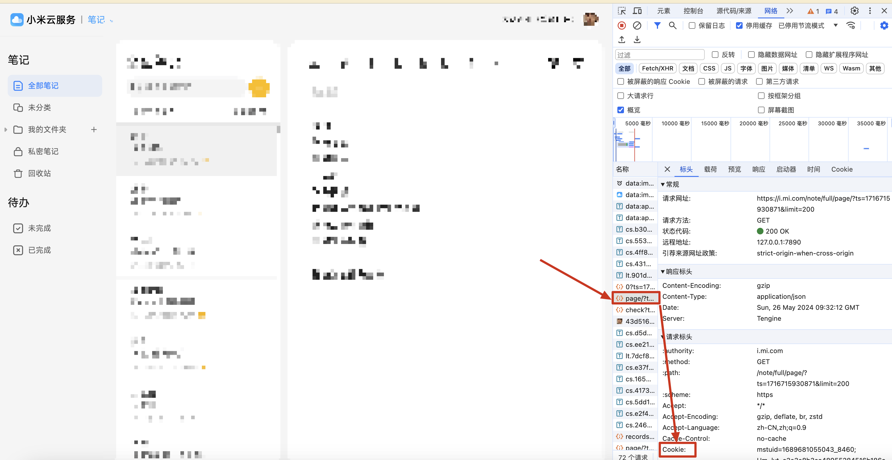
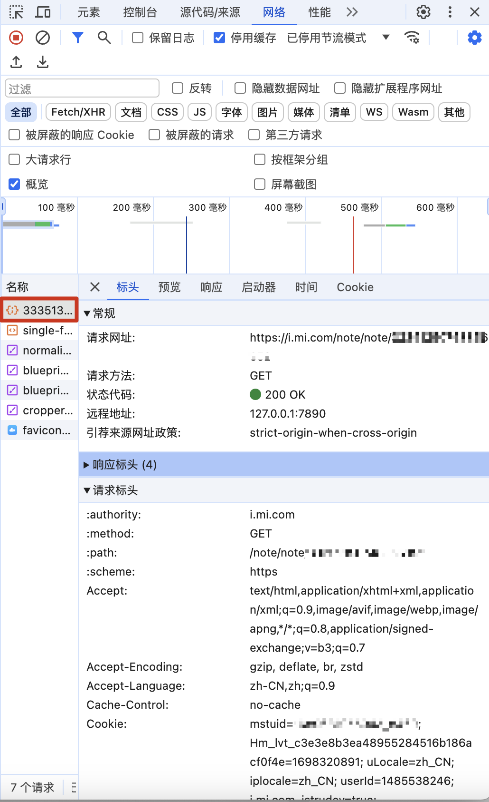

#
该项目可以保存所有的笔记（默认按照创建时间排序）至output.md文档中

## 思路
1. 首先获取目录json
  https://i.mi.com/note/full/page/?limit=200

  注意：必须携带cookie，否则鉴权一定失败，且cookie会更新，若发现鉴权失败则需要更新cookie。

  返回的数据格式：

  

  - entries: 笔记条目

    

    - createDate:笔记创建时间戳
    - modifyDate:笔记最后一次修改的时间戳
    - snippet:笔记内容摘要
    - subject：题目
    - id：笔记的唯一id，用于获取笔记的具体内容，详见章节2

  - syncTag：翻页参数，返回的json携带该参数，表示下一页目录。链接中携带该参数，则返回的即为下一页的目录json，例如：https://i.mi.com/note/full/page/?limit=200&syncTag=32584391066010144

  - ts：时间戳，具体作用不明

  

2. 获取每条笔记的json

​		链接：https://i.mi.com/note/note/+笔记id

​		例子：https://i.mi.com/note/note/3335135274885625	

- content: 完整笔记内容

- setting

  - fileId:文件id，若是图片，可以通过https://i.mi.com/file/full?type=note_img&fileid={fileId}来获取，该链接会在响应头返回并重定向至另一个链接：类似

    https://ali.xmssdn.micloud.mi.com/2/1566455553514/download_file?attachment=0&fn=MTcxNjcxNzE1NA&ct=application%2Foctet-stream&meta=QzHsJp6hT9aLkh1ElSWgSs8PMSqYB01TSkWi70AaedKl1bcGl72hC4lX_6AzwpGyBLMPNO5vvTzjurXirOfds8IKaVhKwlmFSq-by9bThuI26WEQnq6GXqpqF6B2osAnmDrfM5gQhABex2DGLXl5kDhpN44_Vn-8gwLUjqoGjqhO9NQSkLrkiZtwfFdLddGJCRB8QOE_NkyHz0vHdFPs7ZeBttgOMHR4-tmm6PMZteufhcNJ8BzMC9AV8g&ts=1716803554000&sig=g8Pz1Dfu6ozzuOmIZCm9IgOsO3E&_cachekey=411ee99d49e06707cb95b24088d261fb

    

    该链接为文件的真实链接

  - mimeType：文件类型

## 获取cookie

获取目录的cookie：

获取单条笔记的cookie：

